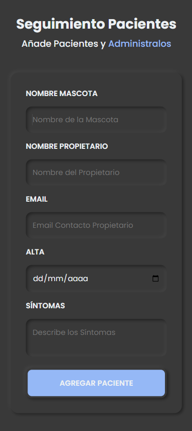
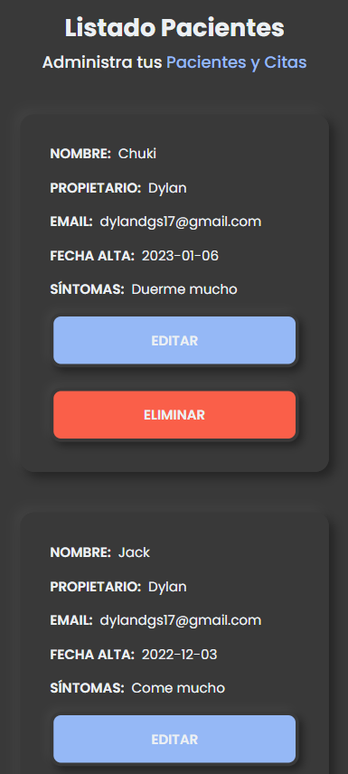
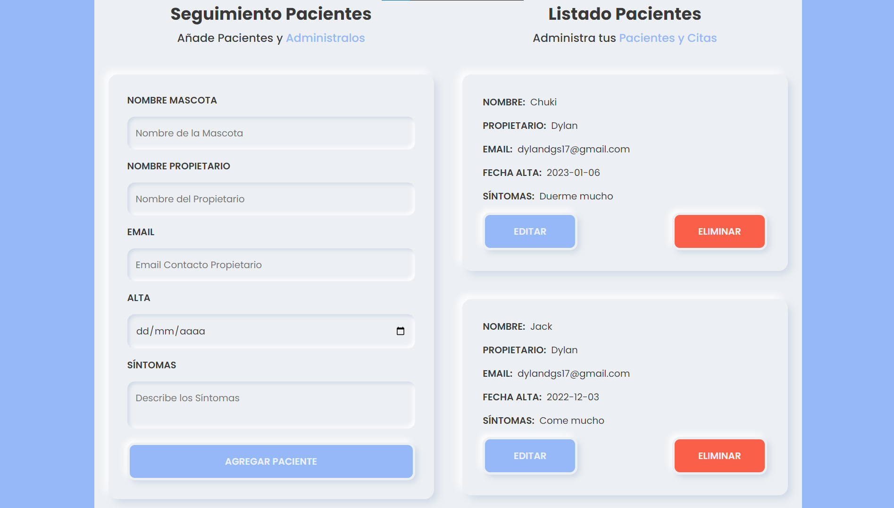

# 1er Proyecto de curso de Udemy :nerd_face:
## Seguimiento de pacientes

**Profesor**: Juan Pablo De la torre Valdez

**Pagina**: [Link Veterinaria](https://santillan-veterinaria-curso.vercel.app/)

**Linkedin**: [Dylan Santillán](https://www.linkedin.com/in/dylansantillan/)

- **Diseño**:
  - Neomorfismo 

- **Tecnologías**: 
  - React JS 
  - SASS 

- **Qué aprendí en este proyecto**:
  - Conceptos básicos de react
  - useState
  - useEffect
  - LocalStorage
  - Hacer un DarkMode :last_quarter_moon:

### Proyecto en mobile - DarkMode :iphone:

### Proyecto en desktop - LightMode :computer:

