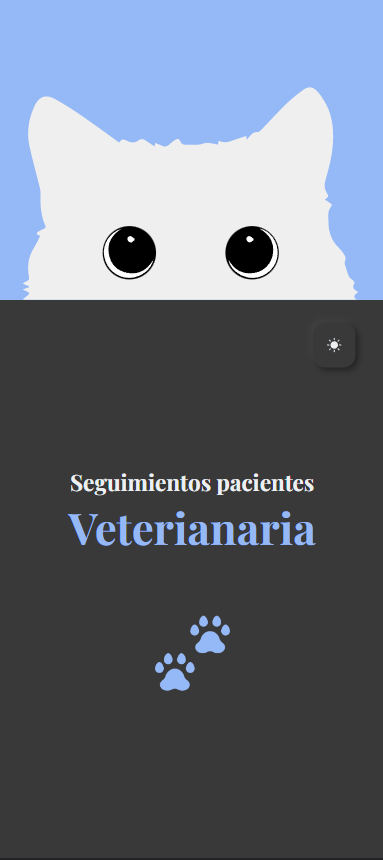
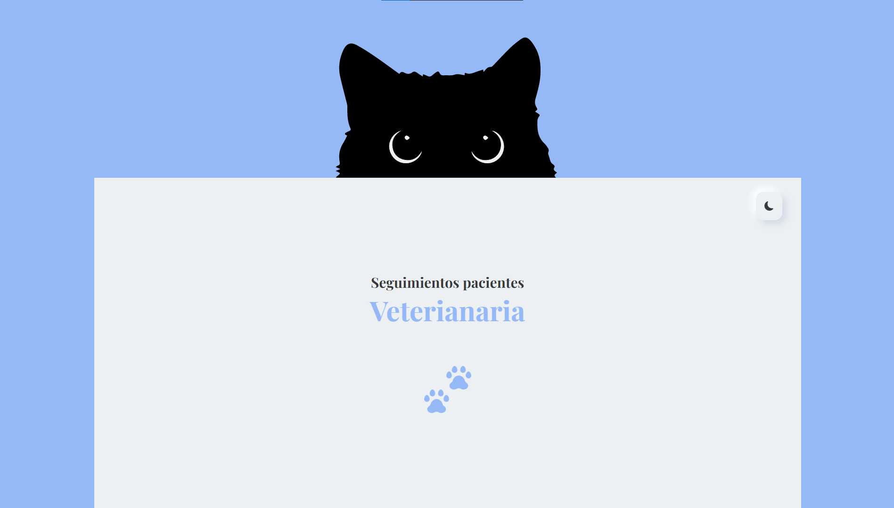

# 1er Proyecto de curso de Udemy :nerd_face:
## Seguimiento de pacientes

- Diseño:
  - Neomorfismo 

- Tecnologías: 
  - React JS 
  - SASS 

- Qué aprendí en este proyecto:
  - useState
  - useEffect
  - LocalStorage
  - Hacer un DarkMode :last_quarter_moon:

### Proyecto en mobile - DarkMode :iphone:

### Proyecto en desktop - LightMode :computer:

